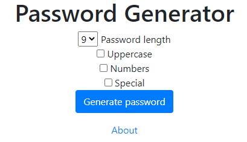

# Password Generator
> A simple website to generate random passwords

## Table of contents
* [General info](#general-info)
* [Screenshots](#screenshots)
* [Technologies](#technologies)
* [Setup](#setup)
* [Features](#features)
* [Status](#status)
* [Inspiration](#inspiration)
* [Contact](#contact)

## General info
Currently the website is only available in Polish.

## Screenshots

## Technologies
* Django - version 3.0
* Python - version 3.8
* HTML, CSS

## Setup
https://whispering-tundra-54870.herokuapp.com/

## Code Examples
Show examples of usage:
`put-your-code-here`

## Features
List of features ready and TODOs for future development
* You can choose the length of generated password
* You can specify whether to add uppercase, special or numeric characters

To-do list:
* Add english version of the website

## Status
Project is: _in progress_

## Contact
Created by [@jakubprach](http://github.com/jakubprach/) - feel free to contact me!
